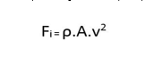
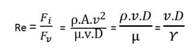

This folder has 
### Aim
Determine the Reynolds number and study different types of flow according to the Reynolds number
### Theory
'Reynolds number' is the ratio of the inertial force of flowing fluid to the viscous force of the fluid. Inertial force of the fluid can be expressed as: 

 Inertial force, Fi = mass × acceleration 
                                = (density × volume) × (Velocity / time) 
       = (density × Area) × (Velocity × Velocity) 
       
 
Viscous force, Fv = Shear stress × area 

 
Therefore, Reynolds number is given by: 

 
Where, v = velocity of fluid flow 
D = diameter of glass tube 
ρ = Density of fluid 
µ = Dynamic viscosity of fluid 
γ = Kinematic viscosity of fluid 

<h5>Apparatus Required:</h5>
•	A Tank filled with water 
•	A small reservoir filled with coloured fluid or dye 
•	A glass tube with bell-mouth entrance 
•	A measuring tank 
•	Regulating valve at the outlet of glass tube and at inlet of dye injector 
•	A stopwatch 

### Procedure
Test Procedure of Reynolds experiment is as follows: 
•	Fill the tank with water and leave it for some time as the water in the tank should come to rest. 
•	Now fill the reservoir with a dye (generally potassium permanganate solution) which is nothing but coloured fluid. The weight density of dye should be same as that of water. 
•	Record the temperature of water. 
•	Allow the flow through the glass tube at a very low rate by partially opening the outlet valve of a glass tube. 
•	When the flow is stable, open the inlet valve of dye injector and allow the coloured fluid to flow through the glass tube. 
•	Observe the appearance of dye filament in the glass tube and note down the type of flow obtained for that particular discharge. 
•	Take a stopwatch and note down the volume of water collected in measuring for 50 sec. 
•	Repeat the above procedure for different discharge rates and calculate Reynolds’s number for each type of flow. 

### Pre Test
1) What are the unit(s) of the Reynolds number? (LO1) 
a)	<b>It is unitless </b> 
b)	kg·s  
c)	kg/s  
d)	kg/m3  
  

2) Which type of fluid flow is smooth, and predictable? (LO3) 
a)	Turbulent 
b)	Viscous 
c)	<b>Laminar </b> 
d)	Inertial 
  

3) What value of Reynolds number indicates laminar flow? (LO1, LO2 and LO3) 
a)	<b>2000 </b> 
b)	5000 
c)	7000 
d)	10000 
  

4) The ratio of inertia force to viscous force is known as (LO1 and LO2) 
a)	Grashof number 
b)	<b>Reynolds number</b>  
c)	Fourier number 
d)	Nusselt number 
  

5) In Reynolds number (ρvd) / μ, the letter μ denotes (LO1 and LO2) 
a)	kinematic viscosity 
b)	<b>absolute viscosity</b> 
c)	coefficient of friction 
d)	none of the above 

### Post Test
Q 1. Velocity within the given fields would be similar in magnitude, direction and turbulence pattern when (LO1, LO2 and LO3) 
a)	Nusselt number are different 
b)	Nusselt number are same 
c)	Reynolds number are different 
d)	<b>Reynolds number are same</b> 
  

Q 2. A pipe has a diameter of 0.2 m in which a fluid flows with a velocity of 0.3 m3/s. Determine whether the flow is laminar or turbulent calculating the Reynolds number. Assume kinematic viscosity = 0.5 × 10-4 m2 /s. (LO1, LO2 and LO3)  
a)	<b>the flow is laminar having Reynolds number 1200</b> 
b)	the flow is turbulent having Reynolds number 2100 
c)	the flow is laminar having Reynolds number 2200 
d)	the flow is neither laminar nor turbulent 
  

Q 3. What is the appropriate definition of streamflow? (LO3) 
a)	The way in which water moves within a stream channel 
b)	The direction of the flow of the water within a stream 
c)	<b>The velocity of the water within a stream </b>  
d)	The amount of water within a stream 
  

Q 4. Which of the following is NOT a characteristic of a stream with laminar streamflow? (LO3) 
a)	Quiet 
b)	<b>Water that moves quickly </b> 
c)	Water that flows in a straight line 
d)	No visible physical barriers 
  

Q 5. The turbulent flow has (LO3) 
a)	streakline motion 
b)	parabolic velocity distribution 
c)	<b>random orientation of fluid particles </b> 
d)	small slope of velocity profile at the wall 
### References

1. R.J. Goldstein (Editor), Fluid Mechanics Measurements, Hemisphere Publishing 
Corporation, New York, 1983; second edition, 1996.
2. M. Van Dyke, An Album of Fluid Motion, The Parabolic Press, California, 1982.
3. D.C. Montgomery, Design and Analysis of Experiments, John Wiley, New York, 2001.
4. A.S. Morris, Principles of Measurement and Instrumentation, Prentice Hall of India, New 
Delhi, 1999.
