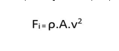
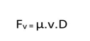
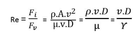

### Theory

'Reynolds number' is the ratio of the inertial force of flowing fluid to the viscous force of the fluid. Inertial force of the fluid can be expressed as: 

 Inertial force, Fi = mass × acceleration 
                                = (density × volume) × (Velocity / time) 
       = (density × Area) × (Velocity × Velocity) 
       
 
Viscous force, Fv = Shear stress × area 

 
Therefore, Reynolds number is given by: 

 
Where, v = velocity of fluid flow 
D = diameter of glass tube 
ρ = Density of fluid 
µ = Dynamic viscosity of fluid 
γ = Kinematic viscosity of fluid 

<h5>Apparatus Required:</h5>
•	A Tank filled with water 
•	A small reservoir filled with coloured fluid or dye 
•	A glass tube with bell-mouth entrance 
•	A measuring tank 
•	Regulating valve at the outlet of glass tube and at inlet of dye injector 
•	A stopwatch 
