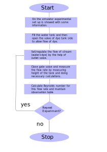

## Storyboard (Round 2)

Experiment 1: Determine the Reynolds Number and study Different Types of Flow.

### 1. Story Outline:

This experiment contains fresh water in a tank and dye in other small tank placed above water tank. Water and dye will flow through delivery pipe to the reservoir via collecting tank. 
The basic objective of this experiment is to recall Reynolds number and understand the significance of Reynolds number. Also student will be able to visualize different flow patterns with Change in flow rate stream flowing through delivery pipe.

### 2. Story:

First user will switch on the motor. Then water will start to flow from reservoir to the water tank then to the delivery pipe. Then user will open the valve at dye tank side to allow dye to flow through delivery pipe. 
After this user will regulate the flow rate by using outlet valve. Now user will close the gate valve, fluid will start filling in collecting tank. After 50 seconds final height will appear on the simulator and this height will be recorded by the user for calculating flow rate of water. As the flow rate of stream changes the Reynolds number will change and accordingly flow patterns will change from Laminar to transient to turbulent flow. User can understand change of flow pattern by the help of calculation also i.e by doing calculation for Reynolds number. For laminar flow ( Reynolds number vary from 0 to 2000).
for transient flow (Reynolds number is 2000 to 4000), and for turbulent flow (Reynolds number greater than 4000).

#### 2.1 Set the Visual Stage Description:
In the simulator user will be able to see the virtual prototype of experimental set up resembling the actual experimental set up that is present in real time labs.
In the set up there is large volume water tank placed on stands at some distance above the ground. Above the water tank there is a small dye tank containing dye ( it can be any coloured dye) with some properties required for experiment. At bottom side of tank there is a delivery pipe connected having diameter of 0.01 m. Also from the dye tank, a pipe of very less diameter is connected to the middle of the delivery pipe at water tank side. Between dye tank and connected pipe there is a valve for controlling flow of dye. 
Then at the end of delivery pipe, there is outlet valve that is used to regulate the flow. Then there is a collecting tank having 100cm2 area in which water drops from the delivery pipe and at bottom side of this tank there is a gate valve and then a reservoir is present below that collecting to tank.

#### 2.2 Set User Objectives & Goals:
1) By this experiment student will be able to recall the Reynolds number.
2) This experiment will describe the application of Reynolds number.
3) Student will be able to understand the calculation of flow rate by measuring height in collecting tank.
4) Student will be able to recall  the basic properties of Laminar flow, Transient flow, and Turbulent flow.
5) Student will be able to analyse different flow patterns at different flow rates.

#### 2.3 Set the Pathway Activities:

1) In the experimental set up, there is a centrifugal pump,  outlet valve and gate valve. This all will be recognised by user as each have naming in the set up.
2) User will start the pump by clicking on the motor button.
3) Then user will on the valve present at dye tank side. Also after that by the help of outlet valve user will regulate the flow rate of water through the delivery pipe.
4) Then by closing the gate valve student will be able to collect water in the collecting tank for measuring height by which student will understand the calculation of flow rate and will calculate the same.
5) As students will change the flow rate then they will be able to visualise different flow patterns.
6) Student will be able to analyse flow regimes with change in flow rate that will also change Reynolds number.

##### 2.4 Set Challenges and Questions/Complexity/Variations in Questions:

1) Pipe has a diameter of 0.2 m in which a fluid flows with a velocity of 0.3 m3/s. Determine whether the flow is laminar or turbulent calculating the Reynolds number. Assume kinematic viscosity = 0.5 × 10-4 m2 /s. (LO1, LO2 and LO3)  
a) <b> the flow is laminar having Reynolds number 1200 </b>  
b)	the flow is turbulent having Reynolds number 2100  
c)	the flow is laminar having Reynolds number 2200 
d)	the flow is neither laminar nor turbulent 
 
2) Which of the following is NOT a characteristic of a stream with laminar streamflow? (LO3) 
a)	Quiet  
b) <b>Water that moves quickly </b>  
c)	Water that flows in a straight line  
d)	No visible physical barriers.  

##### 2.5 Allow pitfalls:
1) If user doen't open dye valve and allow only water to flow then doesn't able to visualise any flow pattern. 
2) If user doesn't open gate valve after taking reading for calculating flow rate then the collection tank will overflow.

##### 2.6 Conclusion:
There were two assessments i.e pre-assessment and post-assessment having total 10 questions of different difficulty level. Right answered questions will get 1 mark while wrong answered question will get 0 mark. Hence after answering particular set of question student will get score on the basis of answers given. 
User will take approximate 7-10 minutes for understanding the procedure. Then for generating data by the help of simulator will take 3-5 minutes. In this along with generation of data student will be able to visualise different flow patterns also. After onwards for calculating result will take 5 minutes. Hence total time taken for doing experiment will be approximately 20 minutes.

##### 2.7 Equations/formulas: NA
<h5> Reynold's number:</h5>
Re= 	(ρ*v*d)/μ   
Flow Rate: Q= (Area*Height)/time  
where,
 
 ρ= density of fluid  
 μ= dynamic viscosity  
 d= diameter of pipe  
 v= velocity of fluid  
 

### 3. Flowchart 4
 
link to flow chart Here : https://github.com/Simulators368/Reynolds-experiment/blob/master/storyboard/flowchart/flowchart.svg
 

### 4. Mindmap:

 Link to mindmap here : Store the mindmap in both .mm & .png extension in the  /mindmap folder and include link of only .pdf verison here
  
 (guide : An elaborate mind map (connecting all the points in the experiment flow ) should be prepared and submitted by the lab proposer. The mind map should be a clear and detailed document that takes into account all minute intri5acies involved in the development of virtual lab. The mindmap should be self-content and any developer across the globe should be able to code it with all those details. using only FreeMind http://freemind.sourceforge.net/wiki/index.php/Main_Page (send the .png file and also the original .mm extension project file. )

### 5. Storyboard :
Storyboard: <a href="Storyboard/carwiper.gif"> [here]</a>
Link to storybaord (.gif file ) here :
(guide: This document should include sketching and description scene wise (duration, action, description). Software to be used for storyboarding : https://wonderunit.com/storyboarder/ (Its a FOSS tool) . tutorial on how to use it https://www.youtube.com/watch?v=LAeCEpG0KX4
